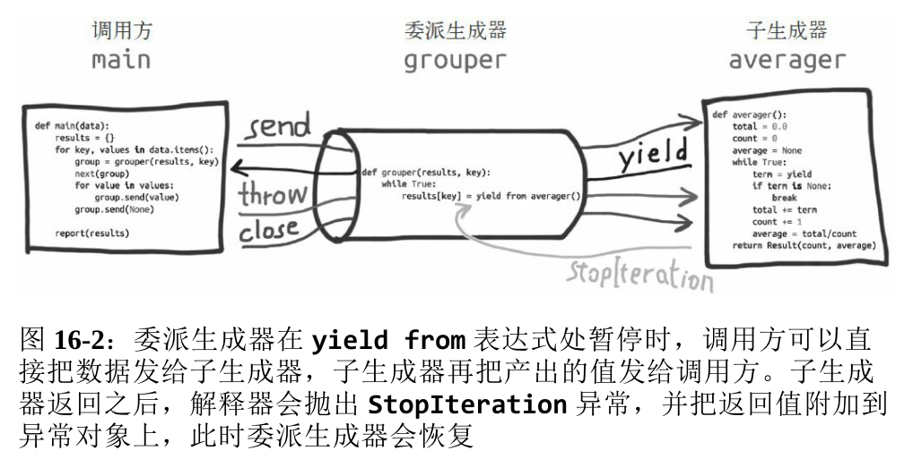
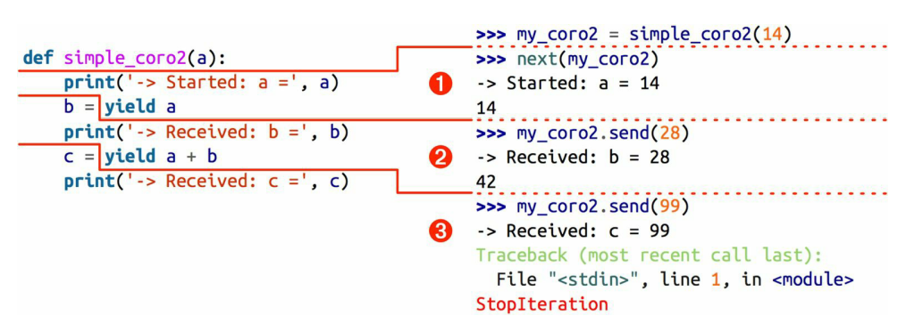

## 记录
### yield from
- yield from 可用于简化 for 循环中的 yield 表达式
- python3.3之前协程不可以有返回值return句法，否则会报句法错
- yield from结构会在内部自动捕获StopIteration异常，并将异常的属性值返回
- 子生成器生产的值，都是直接传给调用方；同样，调用方通过send发送的值直接传给子生成器；如果发送的是None，
会调用子生成器的__next__方法，如果不是None，会调用子生成器的send方法：即正常继续往下执行yield句法
- yield from赋值
    - yield from表达式左边的值由右边函数的返回值赋值
    - 子生成器退出的时候，最后的return EXP会触发一个StopIteration(EXPR)异常
    - value = yield from Iterable 表达式的中value值，是子生成器终止时，传递给StopIteration异常的第一个参数
- 如果调用的时候出现StopIteration异常，委托生成器会恢复运行，同时其他的异常会向上“冒泡”
- 传入委托生成器的异常中，除了GeneratorExit之外，其他所有的异常全部传递给子生成器的throw方法，如果调用throw的时候出现StopIteration异常，
那么恢复委托生成器的运行，其他的异常全部向上“冒泡”
- 如果在委托生成器上调用close或传入GeneratorExit异常，会调用子生成器的close方法，没有的话就不调用。如果调用close时抛出异常，
那么就向上“冒泡”，否则的话委托生成器会抛出GeneratorExit异常
- yield from x 表达式对 x 对象所做的第一件事是，调用 iter(x)，从中获取迭代器。因此，x 可以是任何可迭代的对象
- yield from 的主要功能是打开双向通道，把最外层的调用方与最内层的子生成器连接起来，这样二者可以直接发送和产出值，还可以直接传入异常，
而不用在位于中间的协程中添加大量处理异常的样板代码。有了这个结构，协程可以通过以前不可能的方式委托职责。
- 三方结构
    - 委派生成器（中间通道）：包含yield from <iterable> 表达式的生成器函数
    - 子生成器：<iterable>部分获取的生成器
    - 调用方（客户端）：调用委派生成器的客户端代码
- 
- 
- 协程的不正式定义：通过客户调用 .send(...) 方法发送数据或使用 yield from 结构驱动的生成器函数。